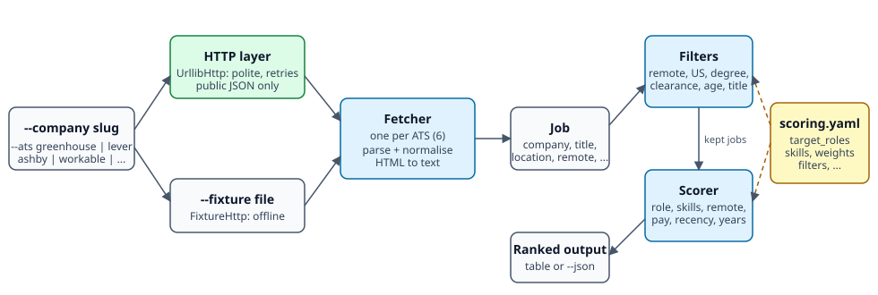

# ats-job-discovery

Fetch job postings straight from the public JSON APIs of six applicant tracking systems (Greenhouse, Lever, Ashby,
Workable, Recruitee, SmartRecruiters), normalise them to one `Job` record, drop the ones that break your hard rules
(not remote, not US, degree required, clearance required, stale), and rank the rest with a scorer you configure in a
small YAML file.

Pure Python, one dependency (`pyyaml`), HTTP over the standard library, and an injectable HTTP layer so the whole test
suite runs offline.

## The problem

Company career pages are scattered across many ATS vendors. Job aggregators lag, duplicate, and hide the original
posting. But most ATS vendors publish every open role on a company board as unauthenticated JSON, because their own
embeddable job widgets read it. Those payloads differ in field names, date formats, how they flag remote work, and
whether the description is HTML, plain text or on a second endpoint. This project reads them directly, smooths over
the differences, and gives you a ranked list that reflects *your* criteria instead of an aggregator's.

## How it works



```
  --company stripe --ats greenhouse                       scoring.yaml
              |                                      (roles, skills, weights,
              v                                       filters, pay floor, ...)
   +----------------------+                                   |
   |  HTTP layer          |   --fixture FILE                  |
   |  UrllibHttp: polite, |<--------------- FixtureHttp       |
   |  retries, JSON only  |   (offline, saved payload)        |
   +----------+-----------+                                   |
              v                                               |
   +----------------------+      +---------+     +-----------v----------+
   |  Fetcher (one / ATS) |----->|   Job   |---->|  Filters  -> Scorer  |
   |  parse + normalise   |      | dataclass|    |  drop / 0..100 score |
   +----------------------+      +---------+     +-----------+----------+
                                                             v
                                                ranked table  or  --json
```

1. **Fetch.** `fetch_jobs(ats, slug, http)` calls the ATS's public endpoint (table below) through an `http` object
   that only needs one method, `get_json(url, params)`. The default is `UrllibHttp`; `FixtureHttp` serves a saved file.
2. **Normalise.** Each fetcher maps its vendor's fields onto `Job`: company, title, location, `remote` (True / False /
   None), url, description as plain text, posted date (UTC ISO-8601), employment type, pay when structured, and an
   inferred `remote_scope` (`us` / `worldwide` / `other` / `unknown`).
3. **Filter.** Rules for remote, US, degree, clearance, age, years of experience and title (all optional, all
   configured in the YAML `filters:` section).
4. **Score.** A rule-based 0-100 score from role match, skill keywords, remote scope, pay, recency, experience fit and
   title adjustments. The breakdown is kept per job (`--json`).
5. **Print.** Ranked table or JSON.

## Install

Python 3.11 or newer.

```bash
git clone <this repository>
cd ats-job-discovery
python -m pip install -e .            # runtime: pyyaml
python -m pip install -e ".[test]"    # adds pytest
```

## Usage

```bash
# fetch one board and print the ranked jobs
python -m ats_discovery --company stripe --ats greenhouse --limit 10

# your own scoring file, JSON out, only jobs scoring 50 or more
python -m ats_discovery --company ramp --ats ashby --config scoring.yaml --min-score 50 --json

# offline: read a saved API payload instead of the network
python -m ats_discovery --company stripe --ats greenhouse --fixture tests/fixtures/greenhouse.json

# many boards at once (sequential, rate limited)
python -m ats_discovery --all-companies companies.example.yaml --limit 25

# start your own config from the packaged example
python -m ats_discovery --print-config > scoring.yaml
```

| Option | Meaning |
| --- | --- |
| `--company SLUG --ats ATS` | The board and its ATS (`greenhouse`, `lever`, `ashby`, `workable`, `recruitee`, `smartrecruiters`). The slug is the id in the company's careers URL. |
| `--name NAME` | Display name for `--company` (default: the name the API reports, else the slug). |
| `--all-companies FILE` | YAML list of boards, format in `companies.example.yaml`. `--ats` narrows it to one ATS. A board that 404s is skipped with a warning. |
| `--config YAML` | Scoring file. Default: the packaged `scoring.example.yaml`. |
| `--limit N` | Print at most N jobs. |
| `--min-score S` | Hide jobs scoring below S. |
| `--json` | JSON (including the score breakdown and flags) instead of the table. |
| `--fixture PATH` | Read a saved JSON payload instead of the network. Needs `--company` and `--ats`. |
| `--no-filters` | Score everything, skipping the hard rules. |
| `--as-of ISO_DATE` | Evaluate age and recency as of a fixed date (reproducible output, used by the tests). |
| `--delay SEC` | Minimum seconds between HTTP requests (default 0.5). |
| `--print-config` | Print the packaged example YAML and exit. |

Table columns are `SCORE COMPANY TITLE LOCATION URL`. Progress and a one-line summary go to stderr, so
`--json > out.json` stays clean.

As a library:

```python
from ats_discovery import fetch_jobs, load_config, rank

jobs = fetch_jobs("greenhouse", "stripe")           # polite UrllibHttp by default
for s in rank(jobs, load_config("scoring.yaml"))[:10]:
    print(s.score, s.job.title, s.job.url)
```

### Fixture format

A fixture is the JSON the list endpoint returns. SmartRecruiters needs a second call per posting for the description,
so its fixture has one extra top-level key, `details`, mapping posting id to the detail payload.

## Scoring YAML reference

Start from `ats_discovery/scoring.example.yaml` (or `--print-config`). Every key is optional; unspecified keys keep
the defaults shown below. **Unknown keys are an error**, so a typo cannot silently do nothing. With the example values
a perfect posting scores about 98 and the result is clamped to 0-100.

| Key | Default | Meaning |
| --- | --- | --- |
| `target_roles` | `[]` | Role names to match against the title. A title containing every word of any role earns the full `role_max_points`; near-misses get partial credit (token-sorted fuzzy ratio, or half credit when at least half the words match). |
| `role_max_points` | `40` | Maximum points for role match. |
| `skills` | `{}` | `keyword: weight`. Whole-word, case-insensitive match in the title and the first `description_chars` of the description (so `go` does not match `mongo`; `c++` and `node.js` work). A key starting with `re:` is a raw regex. |
| `skill_max_points` | `25` | Maximum skill points. |
| `skill_saturation` | `14` | Total matched weight at which skill points reach the maximum: `points = skill_max_points * min(1, total / skill_saturation)`. |
| `description_chars` | `3500` | How much of the description is searched for skills. |
| `remote_bonus` | `us: 10, worldwide: 9, unknown: 4.5, other: 0, unverified: 3` | Points for a remote posting by inferred scope. `unverified` = the text only mentions remote work loosely. On-site / hybrid jobs get 0 unless you add `onsite` / `hybrid` keys. |
| `salary.floor_usd_per_year` | `null` | Your yearly pay floor. With both floors `null`, salary scoring is off. |
| `salary.floor_usd_per_hour` | `null` | Your hourly floor (also used for contract roles quoted yearly, at 2080 h/year). |
| `salary.max_points` | `7` | Points when the listed minimum meets the floor (about 5/7 of that when only the top of the range reaches it; 0 below). |
| `salary.unknown_points` | `4` | Neutral points when no pay is listed. |
| `recency` | `{3: 6, 7: 5, 14: 4, 21: 2.5, 30: 1.5}` | `max age in days: points`. Older than the largest key scores 0. |
| `recency_unknown_points` | `3` | Points when the ATS gives no date. |
| `experience.base_points` | `10` | Points for a posting whose required years fit your range. |
| `experience.min_years` / `max_years` | `0` / `6` | Your years-of-experience range. The posting's highest hard requirement (preferred / nice-to-have text is ignored) is compared with it. |
| `experience.over_penalty_per_year` | `5` | Points lost per year the posting asks above `max_years`. |
| `experience.under_penalty_per_year` | `0` | Points lost per year it asks below `min_years`. |
| `experience.max_penalty` | `30` | Cap on the experience penalty. |
| `title_boosts` | `{}` | `regex: points` added when the regex matches the title (case-insensitive). |
| `title_penalties` | `{}` | `regex: points` subtracted when it matches. Write the number as positive. |
| `clearance_soft_penalty` | `3` | Penalty when a clearance is only "eligible to obtain" / "may require" / "preferred". |
| `off_target.role_fraction` | `0.4` | If the role score is below this fraction of `role_max_points`... |
| `off_target.max_total` | `54` | ...the total score is capped here, so keyword-stuffed off-target titles cannot rank high. |
| `filters.require_remote` | `true` | Drop on-site and hybrid postings. A remote flag from the ATS wins over on-site-sounding boilerplate. |
| `filters.require_us` | `true` | Drop remote postings scoped to another region, or demanding work authorisation in a named non-US country. |
| `filters.reject_degree_required` | `true` | Drop when a degree is stated as strictly required. "Or equivalent experience", "preferred" and plain wish lists do not count. |
| `filters.reject_active_clearance` | `true` | Drop when an *active* clearance (TS/SCI, active Secret, polygraph) is mandatory. "Eligible to obtain" is only the soft penalty above. |
| `filters.max_age_days` | `30` | Drop postings older than this; `null` disables. |
| `filters.max_years_required` | `null` | Drop when the description requires more years than this; `null` disables. |
| `filters.title_include` | `[]` | Regexes; the title must match at least one. Empty list = no gate. |
| `filters.title_exclude` | `[]` | Regexes; any match drops the posting. |

Filtered jobs are not printed. With `--json --no-filters` you can see everything; a job dropped by a rule gets
`score 0`, the `skip_reason`, and its would-be score under `breakdown.would_score` when evaluated through the library.

## Supported ATS endpoints

| ATS | Endpoint (all public, no key) | Notes |
| --- | --- | --- |
| Greenhouse | `GET https://boards-api.greenhouse.io/v1/boards/{slug}/jobs?content=true` | Description is HTML-escaped twice; decoded to text. |
| Lever | `GET https://api.lever.co/v0/postings/{slug}?mode=json` | `workplaceType` gives remote / hybrid / onsite; USD `salaryRange` used when present. |
| Ashby | `GET https://api.ashbyhq.com/posting-api/job-board/{slug}?includeCompensation=true` | `isRemote` is true for hybrid roles in real payloads, so only `workplaceType` is trusted. |
| Workable | `GET https://apply.workable.com/api/v1/widget/accounts/{slug}?details=true` | Widget endpoint; the v3 jobs endpoint is POST-only and omits descriptions. |
| Recruitee | `GET https://{slug}.recruitee.com/api/offers/` | Only `published` offers; description + requirements merged. |
| SmartRecruiters | `GET https://api.smartrecruiters.com/v1/companies/{slug}/postings`, then `/postings/{id}` | The list has no description, so detail calls are made for up to 30 postings per board (`max_details`); the rest are returned title-only. |

`companies.example.yaml` lists 25 well-known public boards across the six ATS. Each slug returned a valid payload
from its live API when the file was written. Boards come and go; a slug that later 404s is skipped with a warning.

## A real result

Run against the live Greenhouse API on 2026-10-07 (13:04 UTC) with the packaged example config. This is live output
and not a fixture; the job board changes daily, so your numbers will differ.

```
$ python -m ats_discovery --company stripe --ats greenhouse --limit 10
fetched  718 postings from greenhouse/stripe
718 fetched, 706 filtered out, 12 scored >= 0, showing 10
SCORE  COMPANY  TITLE                                                 LOCATION                            URL
-----  -------  ----------------------------------------------------  ----------------------------------  ---
64     Stripe   Software Engineer, Revenue and Financial Automation   N/A                                 https://stripe.com/jobs/search?gh_jid=8076616
44     Stripe   Offensive Security Engineer                           US - Remote                         https://stripe.com/jobs/search?gh_jid=8233889
38     Stripe   Partner Solutions Engineer, Ecosystem                 US-NYC; US-SF; US-Chicago; US-A...  https://stripe.com/jobs/search?gh_jid=8227563
36     Stripe   Security Engineer                                     US Remote                           https://stripe.com/jobs/search?gh_jid=8174965
36     Stripe   Abuse Research Engineer                               Remote from the US                  https://stripe.com/jobs/search?gh_jid=8172503
31     Stripe   Integration Engineer (Metronome)                      Remote                              https://stripe.com/jobs/search?gh_jid=8175647
24     Stripe   Engineering Manager, Mobile Development Productivity  US-Remote                           https://stripe.com/jobs/search?gh_jid=8229361
21     Stripe   Engineering Manager, Machine Learning - Credit Risk   N/A                                 https://stripe.com/jobs/search?gh_jid=8205280
20     Stripe   Fraud Architect                                       SF-HQ, Chicago, New York, US-Re...  https://stripe.com/jobs/search?gh_jid=8203220
18     Stripe   Engineering Manager of Managers, Service Infrastr...  Seattle, San Francisco              https://stripe.com/jobs/search?gh_jid=8155381
```

Of 718 open postings, 706 were dropped by the default filters: 540 by the example title gate (engineering titles only),
138 as on-site / hybrid, 20 as older than 30 days and 8 as remote outside the US. Scores are low in absolute terms because most of the description keywords in the example config
(python, sql, aws, ...) are not named in Stripe's boilerplate-heavy postings; tune `skills` and `target_roles` for your
own search. The offline equivalent, from the saved 3-posting fixture (no filters, fixed date), is reproducible
byte for byte:

```
$ python -m ats_discovery --company stripe --ats greenhouse --fixture tests/fixtures/greenhouse.json --as-of 2026-10-07 --no-filters
fetched    3 postings from greenhouse/stripe
3 fetched, 0 filtered out, 3 scored >= 0, showing 3
SCORE  COMPANY  TITLE                              LOCATION                            URL
-----  -------  ---------------------------------  ----------------------------------  ---
64     Stripe   Backend Engineer, Core Technology  US-Remote, Chicago, Seattle, Sa...  https://stripe.com/jobs/search?gh_jid=6042172
36     Stripe   Abuse Research Engineer            Remote from the US                  https://stripe.com/jobs/search?gh_jid=8172503
35     Stripe   AI Engineer                        Chicago                             https://stripe.com/jobs/search?gh_jid=8044460
```

## Tests

```bash
python -m pip install -e ".[test]"
python -m pytest -q
```

All tests run offline. `tests/fixtures/<ats>.json` holds three real postings per ATS captured from the live public
APIs (Stripe, Spotify, Ramp, Hugging Face, bunq, ServiceNow) with descriptions truncated to about 600 characters and
contact details and internal fields removed. The suite covers each fetcher, the HTTP layer (retries, 404, throttling),
every filter rule, the scorer driven by YAML (including a custom config that changes the ranking), and the CLI through
`main(argv)` and a subprocess.

## Limits and ethics

- **Public endpoints only.** This tool reads the same unauthenticated JSON that the vendors' embeddable job widgets
  read. It does not log in, solve CAPTCHAs, bypass access controls, scrape HTML, or apply to anything.
- **Be polite.** Requests are spaced by `--delay` (default 0.5 s), identify themselves with an honest User-Agent,
  retry only on 429/5xx with backoff, and never run in parallel. Do not lower the delay to hammer a board; poll
  a company at most a few times a day. `--all-companies` is intentionally sequential.
- **Respect terms of service.** Vendors and individual companies may restrict automated access or reuse of postings.
  Check the terms that apply to you, honour any rate limits or `robots.txt` guidance, and do not republish posting
  text. This project is intended for personal job search and learning.
- **Heuristics are not guarantees.** Remote / US / degree / clearance detection is regex-based on free text. It is
  tuned to avoid false drops, so some ambiguous postings pass (see the `amb_remote` / `amb_degree` flags in `--json`).
  Always read the posting before acting on a score.
- **Coverage.** Only the six listed ATS vendors. A board slug must be known; there is no discovery of which company
  uses which vendor.
- SmartRecruiters descriptions need one extra request each, capped per board; the cap is an argument of
  `fetch_smartrecruiters` (`max_details`).

## Project layout

```
ats_discovery/
  fetchers.py            six ATS fetchers + fetch_jobs()
  transport.py           UrllibHttp (real), FixtureHttp (offline), error types
  models.py              Job dataclass + make_job()
  filters.py             remote / US / degree / clearance / years / age / title rules
  scoring.py             YAML config loader + scorer
  locations.py           remote-scope inference
  textutil.py            HTML to text, dates, pay parsing
  cli.py  __main__.py    command line
  scoring.example.yaml   packaged default config
companies.example.yaml   25 public example boards
docs/pipeline.svg        pipeline diagram
tests/                   pytest suite + fixtures/
```

## License

MIT. Copyright 2026 Trevor Moore (mtrevor380@gmail.com).
